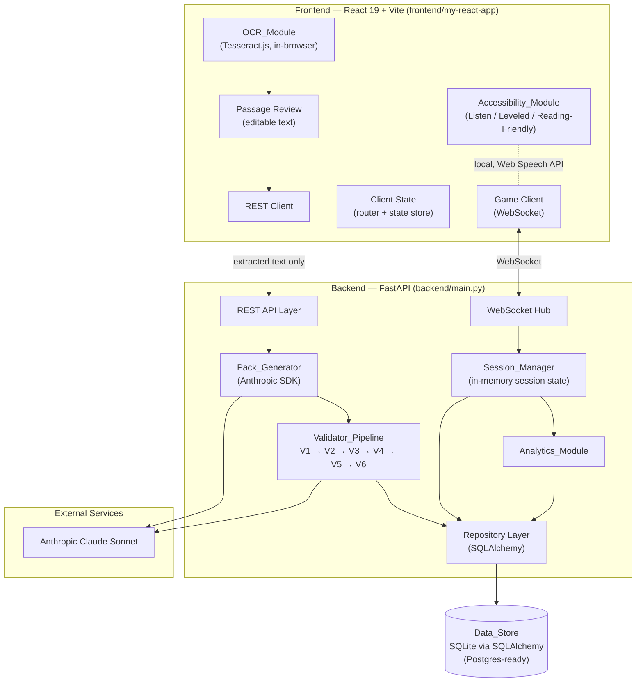

# Design Document

## Overview

The Reading Comprehension Game is a two-tier web platform. A React 19 + Vite single-page application (`frontend/my-react-app`) handles all user interaction, client-side OCR (Tesseract.js), accessibility (Web Speech API), and real-time gameplay over WebSockets. A greenfield FastAPI backend (`backend/main.py`) handles AI pack generation (Anthropic Claude Sonnet), the six-stage validator pipeline, live session orchestration, analytics aggregation, and durable persistence via SQLAlchemy over SQLite (Postgres-migration-ready through connection configuration).

The central design constraint is privacy and correctness: photographs never leave the browser (only extracted text is transmitted, per Req 1.2), and a generated question pack is never playable until all six validators pass in order (Req 3.1). The platform targets Grade 5–6 students, so reading level (V3), grounding (V2), and safety (V6) are first-class validation stages.

This design maps each component and decision back to the requirements it satisfies.

## Architecture

### High-Level Component Diagram



### Primary Data Flows

**Flow A — Pack creation (Reqs 1, 2, 3, 7):**
1. Host selects a photo; `OCR_Module` validates format/size client-side (Req 1.5, 1.6) and runs Tesseract.js entirely in-browser, emitting progress 0–100 (Req 1.3).
2. Extracted text is shown in an editable field (Req 1.4). Only this text is POSTed to the backend (Req 1.2).
3. Backend length-gates the passage (Req 2.2), then `Pack_Generator` calls Claude Sonnet for a 6–12 question pack (Req 2.1, 2.3).
4. The pack enters the `Validator_Pipeline` before it can be playable (Req 2.4, 3.1). On all-pass, the pack is persisted (Req 7.2) and marked playable. On failure, the failing validator id + reason is returned (Req 3.8, 3.9) and regeneration is offered (Req 2.5).

**Flow B — Live session (Reqs 4, 5, 7):**
1. Host starts a session from a playable pack; `Session_Manager` creates in-memory state and issues a unique 4–8 char join code (Req 4.1).
2. Participants connect via WebSocket using the join code, gated by the 40-participant cap (Req 4.2, 4.8).
3. Host advances questions, broadcast to all connected participants (Req 4.3). Answers are accepted once per participant per current question (Req 4.4, 4.5). Dropped clients may rejoin while active (Req 4.7).
4. On session end, results persist (Req 4.6); `Analytics_Module` aggregates per-skill performance and persists it (Req 5.1, 5.6).

### Technology Choices and Rationale

| Concern | Choice | Rationale / Requirement |
|---|---|---|
| OCR | Tesseract.js (client-side) | Photos never leave browser (Req 1.2) |
| Frontend framework | React 19 + Vite | Existing scaffold at `frontend/my-react-app` |
| Routing | React Router | Multi-view app (upload, review, host, join, analytics) — no router exists yet |
| Client state | Lightweight store (Zustand) + React context for a11y settings | Session + accessibility state shared across views |
| Frontend tests | Vitest + React Testing Library | No test setup exists yet; Vite-native |
| Backend framework | FastAPI (async) | Async request handling + native WebSockets |
| AI | Anthropic Python SDK (Claude Sonnet) | Pack generation (Req 2.1), V2/V6 checks (Req 3.3, 3.7) |
| Real-time | FastAPI native WebSockets | Live sessions (Req 4) |
| Readability | Flesch-Kincaid (e.g. `textstat`) | V3 grade band (Req 3.4) |
| Persistence | SQLAlchemy + SQLite | Durable store, Postgres-ready via config (Req 7.1, 7.3) |
| Backend tests | pytest + Hypothesis | Property-based coverage of pure logic |

## Components and Interfaces

### REST API

All endpoints are async. Request/response bodies are JSON. Passage text is the only passage-derived payload accepted from the client (Req 1.2).

| Method | Path | Purpose | Requirements |
|---|---|---|---|
| `POST` | `/api/packs/generate` | Submit reviewed passage text; generate + validate a pack | 2.1, 2.2, 2.4, 3.* |
| `POST` | `/api/packs/{pack_id}/regenerate` | Retry generation after a rejection/failure (max 3 per submission) | 2.5, 2.6 |
| `GET` | `/api/packs/{pack_id}` | Fetch a playable pack | 7.1 |
| `POST` | `/api/sessions` | Host starts a session from a playable pack; returns join code | 4.1 |
| `GET` | `/api/sessions/{session_id}/analytics` | Retrieve per-skill analytics for a completed session | 5.4, 5.5 |
| `WS` | `/ws/sessions/{join_code}` | Participant/host live connection | 4.2–4.8 |

**`POST /api/packs/generate` — request**
```json
{ "passage_text": "string (100..10000 chars)", "targeted_skills": ["main_idea", "inference", "vocabulary"] }
```

**`POST /api/packs/generate` — success response**
```json
{
  "pack_id": "uuid",
  "playable": true,
  "question_count": 8,
  "questions": [ { "id": "q1", "prompt": "...", "options": [ { "id": "a", "text": "...", "is_correct": true } ], "skills": ["inference"] } ]
}
```

**`POST /api/packs/generate` — validator rejection response** (Req 3.8, 3.9)
```json
{
  "pack_id": "uuid",
  "playable": false,
  "failure": { "validator": "V3", "reason": "Question 4 scored Flesch-Kincaid grade 7.8 (allowed 5.0–6.9)." },
  "can_regenerate": true
}
```

**`POST /api/packs/generate` — length validation error** (Req 2.2)
```json
{ "error": "passage_length", "message": "Passage must be between 100 and 10000 characters.", "min": 100, "max": 10000 }
```

### WebSocket Message Contract

A single socket per connection at `/ws/sessions/{join_code}`. Messages are JSON envelopes with a `type` discriminator. Server→client and client→server messages share the envelope shape `{ "type": string, "payload": object }`.

**Client → Server**

| type | payload | Meaning | Requirements |
|---|---|---|---|
| `join` | `{ "role": "host"\|"participant", "display_name": "...", "participant_id?": "uuid" }` | Join/rejoin a session; `participant_id` present on rejoin | 4.2, 4.7 |
| `advance` | `{ }` | Host advances to next question | 4.3 |
| `answer` | `{ "question_id": "q3", "option_id": "b" }` | Participant submits an answer | 4.4, 4.5 |
| `end` | `{ }` | Host ends the session | 4.6 |

**Server → Client**

| type | payload | Meaning | Requirements |
|---|---|---|---|
| `joined` | `{ "participant_id": "uuid", "session_state": {...} }` | Join accepted; echoes assigned id (used for rejoin) | 4.2, 4.7 |
| `join_rejected` | `{ "reason": "invalid_code" \| "session_full" }` | Join refused, with distinct reason | 4.8 |
| `question` | `{ "question_id": "q3", "prompt": "...", "options": [{ "id": "b", "text": "..." }] }` | Current question broadcast to all participants (no correctness flags sent) | 4.3 |
| `answer_ack` | `{ "question_id": "q3", "accepted": true }` | Answer recorded | 4.4 |
| `answer_rejected` | `{ "question_id": "q3", "reason": "not_current" \| "already_answered" }` | Answer not accepted; prior answer retained | 4.5 |
| `session_ended` | `{ "results_persisted": true }` | Session over, results persisted | 4.6 |

Correct-answer flags are never broadcast to participants; only the host/analytics path sees the key, preventing answer leakage during play.

### Frontend Components

| Component | Responsibility | Requirements |
|---|---|---|
| `PhotoUpload` | File selection, client-side format/size validation, Tesseract.js invocation, progress bar, error/retry/zero-text states | 1.1, 1.3, 1.5–1.8 |
| `PassageReview` | Editable extracted-text field; submit to backend | 1.4, 2.1 |
| `PackStatus` | Shows generation state, validator failure id+reason, regenerate control | 2.5, 2.6, 3.9 |
| `HostConsole` | Create session, display join code, advance questions, end session, view analytics | 4.1, 4.3, 4.6, 5.4 |
| `JoinScreen` | Enter join code, handle invalid/full errors, rejoin on reconnect | 4.2, 4.7, 4.8 |
| `PlayView` | Render current question, submit answer, show accept/reject | 4.4, 4.5 |
| `AnalyticsView` | Per-skill table (name, total, correct, proportion); no-data message | 5.4, 5.5 |
| `AccessibilityProvider` | Context holding a11y settings; applies within 1s without ending session | 6.4 |
| `ListenButton` | Web Speech API `SpeechSynthesis` playback; unavailable fallback | 6.1, 6.5 |
| `LeveledTextControl` | Reading-level selector spanning below/above the 5–6 band; fetch + retry | 6.2, 6.6 |
| `ReadingDisplaySettings` | Dyslexia-friendly font, line spacing ≥1.5×, char spacing ≥0.12×, contrast ≥4.5:1 | 6.3 |

### Backend Components

- **`Pack_Generator`** — builds the Claude request constraining output to 6–12 questions over targeted skills (Req 2.3), enforces the 30s/3-retry policy (Req 2.6), and hands the parsed pack to the pipeline.
- **`Validator_Pipeline`** — orchestrates V1–V6 in order, short-circuiting on first failure (see below).
- **`Session_Manager`** — owns in-memory `Game_Session` objects keyed by join code; generates unique codes; enforces the 40-cap; tracks per-participant answers; supports rejoin; triggers persistence and analytics on end.
- **`Analytics_Module`** — aggregates persisted responses by `Comprehension_Skill` and computes proportions.
- **Repository Layer** — the only path to the `Data_Store`; wraps SQLAlchemy sessions with transactional rollback (Req 7.4).

## Validator Pipeline Design

The pipeline is an ordered list of validators each implementing a common interface. Evaluation runs V1→V6; the first failure records `(validator_id, reason)` and stops (Req 3.1, 3.8).

```python
from dataclasses import dataclass
from typing import Protocol

@dataclass
class ValidatorResult:
    passed: bool
    reason: str | None = None  # populated only on failure

class Validator(Protocol):
    id: str  # "V1".."V6"
    def validate(self, pack: QuestionPack, passage: str, config: SkillConfig) -> ValidatorResult: ...

@dataclass
class PipelineOutcome:
    playable: bool
    failed_validator: str | None   # e.g. "V3"
    reason: str | None

def run_pipeline(pack: QuestionPack, passage: str, config: SkillConfig,
                 validators: list[Validator]) -> PipelineOutcome:
    for v in validators:  # order V1..V6 is fixed by list construction
        result = v.validate(pack, passage, config)
        if not result.passed:
            return PipelineOutcome(playable=False, failed_validator=v.id, reason=result.reason)
    return PipelineOutcome(playable=True, failed_validator=None, reason=None)
```

| Validator | Check | Mechanism | Requirement |
|---|---|---|---|
| **V1 Structural** | Valid JSON, all schema-required fields non-empty, 1–50 MCQs, exactly one correct option per MCQ | Pure parsing + schema check | 3.2 |
| **V2 Grounding** | Each correct answer is entailed/inferable from the passage; fail if any answer relies on facts not present | Anthropic entailment check | 3.3 |
| **V3 Reading level** | Each question and the passage have Flesch-Kincaid grade in [5.0, 6.9] inclusive | `textstat` FK computation (pure) | 3.4 |
| **V4 Answer-key integrity** | No duplicate options (case-insensitive, trimmed); at most one option entailed as correct | Pure normalization + Anthropic entailment | 3.5 |
| **V5 Skill coverage** | Each question tagged with ≥1 skill from the configured targeted set | Pure membership check | 3.6 |
| **V6 Safety/relevance** | Age-appropriate for Grade 5–6 and relevant to passage topic; fail if any content flagged | Anthropic safety check | 3.7 |

Validators V1, V3, V4 (duplicate check), and V5 are pure functions and are the primary targets of property-based tests. V2, V4 (entailment part), and V6 depend on Anthropic judgments and are covered with mocked example/integration tests.

## Data Models

SQLAlchemy ORM models accessed exclusively through the repository layer (Req 7.3). The database URL comes from connection configuration (`DATABASE_URL`), so switching SQLite↔Postgres requires no model or call-site changes (Req 7.3).

```python
from sqlalchemy.orm import DeclarativeBase, Mapped, mapped_column, relationship

class Base(DeclarativeBase): ...

class User(Base):
    __tablename__ = "users"
    id: Mapped[str] = mapped_column(primary_key=True)      # uuid
    display_name: Mapped[str]
    role: Mapped[str]                                       # "host" | "participant"

class QuestionPack(Base):
    __tablename__ = "question_packs"
    id: Mapped[str] = mapped_column(primary_key=True)
    source_passage: Mapped[str]
    playable: Mapped[bool] = mapped_column(default=False)
    content_json: Mapped[str]                               # serialized questions/options/skills
    created_at: Mapped[str]
    questions: Mapped[list["Question"]] = relationship(back_populates="pack")

class Question(Base):
    __tablename__ = "questions"
    id: Mapped[str] = mapped_column(primary_key=True)
    pack_id: Mapped[str] = mapped_column(...)               # FK -> question_packs.id
    prompt: Mapped[str]
    correct_option_id: Mapped[str]
    skills_json: Mapped[str]                                # list of comprehension skills
    pack: Mapped["QuestionPack"] = relationship(back_populates="questions")

class SessionResult(Base):
    __tablename__ = "session_results"
    id: Mapped[str] = mapped_column(primary_key=True)       # session id
    pack_id: Mapped[str] = mapped_column(...)               # FK -> question_packs.id
    join_code: Mapped[str]
    ended_at: Mapped[str]
    responses: Mapped[list["Response"]] = relationship(back_populates="session")

class Response(Base):
    __tablename__ = "responses"
    id: Mapped[str] = mapped_column(primary_key=True)
    session_id: Mapped[str] = mapped_column(...)            # FK -> session_results.id
    participant_id: Mapped[str]
    question_id: Mapped[str]
    submitted_option_id: Mapped[str]
    is_correct: Mapped[bool]
    skill: Mapped[str]                                      # skill tagged on the question
    session: Mapped["SessionResult"] = relationship(back_populates="responses")

class SkillAnalytics(Base):
    __tablename__ = "skill_analytics"
    id: Mapped[str] = mapped_column(primary_key=True)
    session_id: Mapped[str] = mapped_column(...)            # FK -> session_results.id
    skill: Mapped[str]
    total_count: Mapped[int]
    correct_count: Mapped[int]
    proportion: Mapped[float | None]                        # None when total_count == 0 (Req 5.3)
```

### In-Memory Session State (not persisted until end)

```python
@dataclass
class Participant:
    participant_id: str
    display_name: str
    connected: bool
    answers: dict[str, str]            # question_id -> submitted_option_id

@dataclass
class GameSession:
    session_id: str
    join_code: str                     # 4..8 alphanumeric, unique among active
    pack_id: str
    current_question_id: str | None
    participants: dict[str, Participant]   # keyed by participant_id; cap 40
    active: bool
```

## Error Handling

| Scenario | Handling | Requirement |
|---|---|---|
| Unsupported file type | Client rejects before OCR; prior extracted text retained; error names supported formats | 1.5 |
| File > 10 MB | Client rejects; error names max size | 1.6 |
| OCR yields zero characters | Show no-text message + re-upload control | 1.7 |
| OCR fails mid-extraction | Retain photo in memory; error + retry control | 1.8 |
| Passage length out of 100–10000 | No generation request; length validation error | 2.2 |
| Anthropic failure/timeout (30s) | Report failure; allow retry up to 3 per submission | 2.6 |
| Validator rejection | Return `{validator, reason}`; allow regenerate | 2.5, 3.8, 3.9 |
| Join code invalid vs session full | Distinct `join_rejected` reasons | 4.8 |
| Answer for non-current/already-answered question | `answer_rejected`; prior answer retained | 4.5 |
| Analytics requested with no persisted results | No-analytics message | 5.5 |
| TTS unavailable | Message; keep passage/question text visible | 6.5 |
| Leveled-text variant fetch fails | Message; retain prior text; allow retry | 6.6 |
| Persistence write failure | Transactional rollback (no partial record); report failure; retain in-memory data for retry | 7.4 |

**Persistence transaction pattern (Req 7.4):**
```python
def persist_atomic(repo, write_fn):
    session = repo.new_session()
    try:
        write_fn(session)
        session.commit()
    except Exception:
        session.rollback()          # no partial record remains
        raise PersistenceError()    # caller retains in-memory data and may retry
    finally:
        session.close()
```

## Testing Strategy

A dual approach: property-based tests for pure, input-varying logic, and example/integration tests for UI, external services, and specific error paths.

**Property tests (pytest + Hypothesis, ≥100 iterations each)** target the pure backend logic: V1 structural rules, V3 Flesch-Kincaid banding, V4 duplicate detection, V5 skill membership, pipeline ordering/short-circuit, join-code generation, answer-acceptance, broadcast completeness, analytics proportions, persistence round-trip, and rollback atomicity. Each property test is tagged `Feature: reading-comprehension-game, Property N: {property text}` and references its design property.

**Frontend tests (Vitest + React Testing Library — new setup):** component rendering and interaction (upload states, review field, play view accept/reject, analytics table), accessibility behaviors with mocked `SpeechSynthesis`, and the progress-indicator monotonicity property.

**Integration/example tests:** Anthropic-dependent validators (V2, V6) and generation with mocked SDK responses; WebSocket join/advance/answer/rejoin flows; readability on representative passages; DB round-trip against SQLite with the same models used for Postgres.

Property test configuration: minimum 100 iterations per property; generators cover boundary edges (99/100 and 10000/10001 chars; FK 5.0 and 6.9; exactly 40 participants; empty skill buckets).

## Correctness Properties

*A property is a characteristic or behavior that should hold true across all valid executions of a system—essentially, a formal statement about what the system should do. Properties serve as the bridge between human-readable specifications and machine-verifiable correctness guarantees.*

### Property 1: OCR progress stays within bounds and never regresses

*For any* sequence of raw extraction-progress values reported by the OCR engine, the mapped progress-indicator values shall all lie within 0 to 100 inclusive and shall be non-decreasing over the sequence.

**Validates: Requirements 1.3**

### Property 2: File acceptance equals allowed type and size

*For any* selected file, the file is accepted for extraction if and only if its format is PNG, JPEG, or WebP and its size is 10 MB or less; when rejected, any previously extracted text is left unchanged.

**Validates: Requirements 1.5, 1.6**

### Property 3: Passage length gate

*For any* submitted passage string, a question-pack generation request is attempted if and only if the passage length is between 100 and 10,000 characters inclusive; otherwise no request is made and a length validation error is produced.

**Validates: Requirements 2.1, 2.2**

### Property 4: Generation retries bounded at three

*For any* number of consecutive generation failures within a single submission, a retry is permitted if and only if fewer than 3 attempts have already been made for that submission.

**Validates: Requirements 2.6**

### Property 5: Playability equals all validators passing, in order, short-circuited

*For any* candidate question pack, the pipeline marks it playable if and only if all six validators pass; validators are evaluated in the fixed order V1 through V6; and if the first failing validator is Vk, the recorded outcome identifies Vk with a reason and no validator after Vk is evaluated.

**Validates: Requirements 2.4, 3.1, 3.8**

### Property 6: V1 structural validity

*For any* candidate question pack, V1 passes if and only if the pack is valid JSON, every schema-required field is present and non-empty, the pack contains between 1 and 50 MCQs, and each MCQ has exactly one option flagged correct.

**Validates: Requirements 3.2**

### Property 7: V3 reading-level banding

*For any* text, V3 passes for that text if and only if its Flesch-Kincaid Grade Level is between 5.0 and 6.9 inclusive, applied to the passage and to every question.

**Validates: Requirements 3.4**

### Property 8: V4 option uniqueness

*For any* MCQ, V4's duplicate check passes if and only if, after trimming surrounding whitespace and comparing case-insensitively, all options are distinct, and at most one option is flagged/entailed as correct.

**Validates: Requirements 3.5**

### Property 9: V5 skill coverage

*For any* question pack and configured targeted skill set, V5 passes if and only if every question is tagged with at least one skill drawn from the configured set.

**Validates: Requirements 3.6**

### Property 10: Join codes are well-formed and unique among active sessions

*For any* sequence of session creations, each issued join code consists of 4 to 8 alphanumeric characters and is distinct from the join code of every other currently active session.

**Validates: Requirements 4.1**

### Property 11: Join outcome by code validity and capacity

*For any* join attempt, the outcome is acceptance when the code matches an active session with fewer than 40 participants, a "session full" rejection when it matches an active session with exactly 40 participants, and an "invalid code" rejection when it matches no active session; the full and invalid rejections are distinguishable.

**Validates: Requirements 4.2, 4.8**

### Property 12: Question broadcast reaches every connected participant

*For any* set of connected participants, when the host advances to a question, every connected participant receives exactly the current question.

**Validates: Requirements 4.3**

### Property 13: Answer acceptance and idempotent retention

*For any* answer submission, it is accepted if and only if it targets the current question and the participant has no prior recorded answer for that question; a rejected submission leaves any previously recorded answer unchanged, so repeated or stale submissions never overwrite a recorded answer.

**Validates: Requirements 4.4, 4.5**

### Property 14: Rejoin preserves participant state

*For any* participant that disconnects while a session remains active, rejoining with the join code reattaches to the same participant, preserving that participant's previously recorded answers.

**Validates: Requirements 4.7**

### Property 15: Per-skill analytics aggregation and proportion

*For any* set of recorded responses in a session, each targeted skill is aggregated so that its total count equals the number of responses tagged with that skill and its correct count equals the number of those whose submitted answer matches the question's correct answer; for every skill with a positive total, the proportion equals the correct count divided by the total, rounded to two decimal places and lying within 0.0 to 1.0, with correct count never exceeding total; and any skill with zero responses records a total of 0 and no proportion.

**Validates: Requirements 5.1, 5.2, 5.3**

### Property 16: Reading-friendly contrast threshold

*For any* selectable contrast setting in Reading_Friendly_Display, the resulting text-to-background contrast ratio is at least 4.5 to 1.

**Validates: Requirements 6.3**

### Property 17: Persistence round-trip survives restart

*For any* valid entity (user, question pack, session result, or per-skill analytics) written to the Data_Store, reading it back through a fresh connection returns an entity equal to the one written.

**Validates: Requirements 7.1**

### Property 18: Write failures roll back atomically

*For any* persistence write that fails at any point during the operation, none of that operation's records remain in the Data_Store afterward and the caller receives a persistence failure while retaining its in-memory data.

**Validates: Requirements 7.4**
