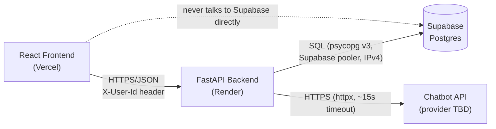
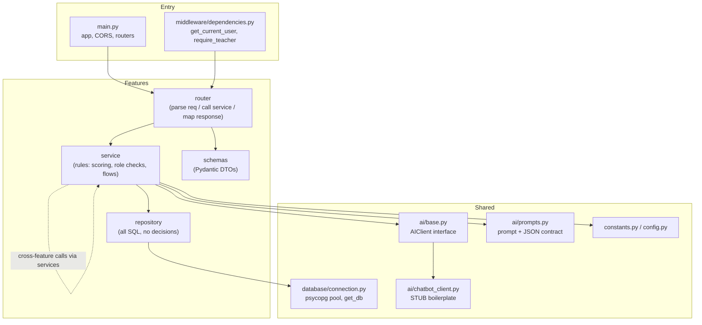
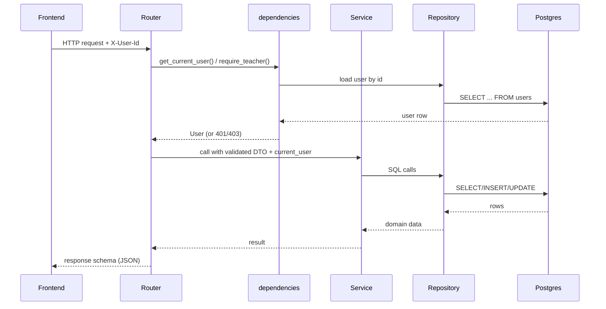
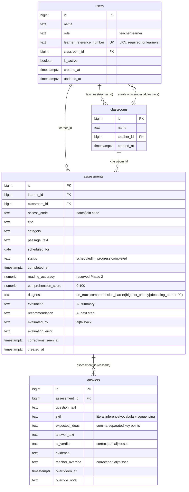
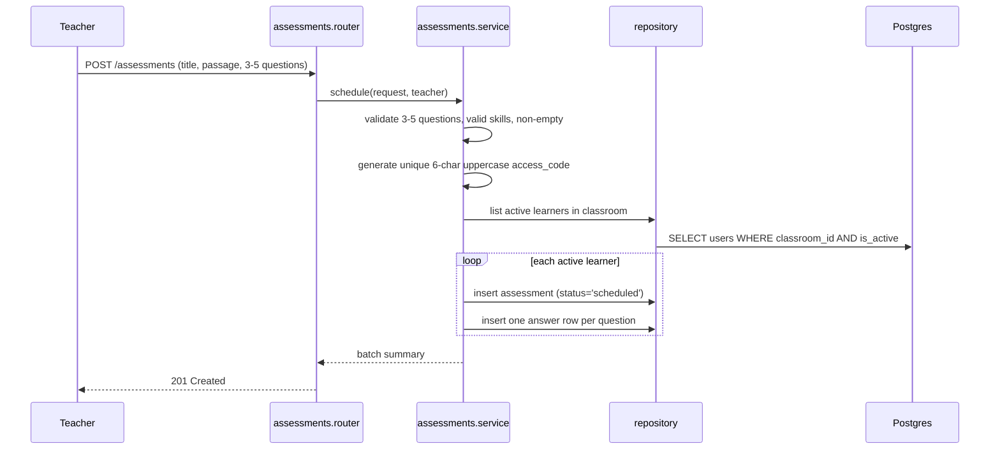
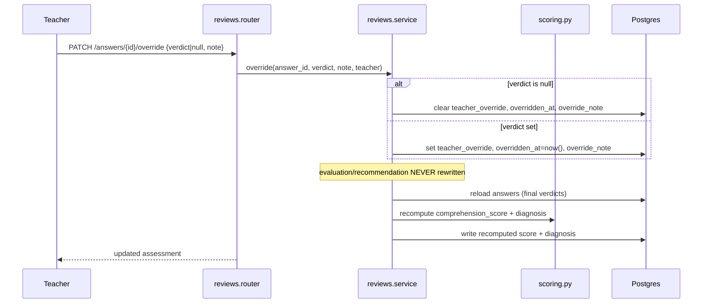

# Design Document: Reading Comprehension Screener — Backend

## Overview

The Reading Comprehension Screener backend is a Python FastAPI service that lets teachers schedule reading assessments, lets learners answer in typed text, runs each submitted assessment through a single AI check, and computes scores and diagnoses in our own code (never the AI). Teachers can always override the AI verdict on any answer, which immediately recomputes the score and diagnosis. The service exposes a JSON HTTP API consumed by a React (Vercel) frontend and persists to a Supabase Postgres database over `psycopg` v3.

The architecture is strictly modular and layered per the source of truth: **router → service → repository**, with Pydantic schemas as DTOs and a swappable `AIClient` abstraction isolating the (yet-to-be-announced) chatbot provider. Security is intentionally minimal — a single `X-User-Id` header identifies the caller; there are no PINs, cookies, rate limiting, or automated tests in this MVP. All "today" comparisons use the `Asia/Manila` timezone.

This design targets the immediate goal of **scaffolding the backend end-to-end with working boilerplate**. The two external dependencies that are not yet finalized — the Supabase connection and the AI provider — are scaffolded so the modular system runs before the AI provider is announced. The Supabase pool is wired for real but reads config from env; `ai/chatbot_client.py` is a stub implementing the `AIClient` interface and returning a deterministic placeholder response so the evaluation pipeline executes end-to-end. When the provider is announced, only `chatbot_client.py` and the cost-per-learner note change.

> **Traceability note:** Every component below maps back to the MVP source of truth. Section references in parentheses (e.g., *SoT: Evaluation Rules*) indicate the originating decision. Phase 2 / out-of-scope items are explicitly excluded.

---

## Architecture

### System context



Faithful to *SoT: Architecture* — the frontend never talks to Supabase directly, the backend uses the Supabase pooler connection string over IPv4, repositories use plain SQL, RLS is enabled on all tables with **no policies** (the backend's direct Postgres role bypasses RLS). Render free instances sleep and are woken via `/health`.

### Layered module architecture



**Layer rules (*SoT: Layer Rules*, enforced by convention):**

- `router`: parses the request, calls a service, maps the result to a response schema. No business rules, no SQL.
- `service`: holds all rules — scoring, role checks, flow orchestration. No SQL.
- `repository`: holds all SQL. No decisions.
- `schemas`: Pydantic DTOs only, no logic.
- Features call each other **through services, never repositories**.
- A router never returns a raw DB row; it always maps to a response schema.

### Request lifecycle



---

## Data Models

All DDL lives in `database/schema.sql`. RLS is enabled on all four tables with no policies (*SoT: Architecture / Data Model*). `updated_at` is set by the app on every update (no DB trigger).

### Entity relationship



### schema.sql (DDL)

```sql
-- database/schema.sql  (traceable to SoT: Data Model)

create table classrooms (
    id          bigint generated always as identity primary key,
    name        text not null,
    teacher_id  bigint not null,
    created_at  timestamptz not null default now()
);

create table users (
    id                       bigint generated always as identity primary key,
    name                     text not null,
    role                     text not null check (role in ('teacher','learner')),
    learner_reference_number text unique,
    classroom_id             bigint references classrooms(id),
    is_active                boolean not null default true,
    created_at               timestamptz not null default now(),
    updated_at               timestamptz not null default now(),
    constraint learner_needs_lrn
        check (role <> 'learner' or learner_reference_number is not null)
);

-- FK added after both tables exist (classrooms.teacher_id -> users.id)
alter table classrooms
    add constraint classrooms_teacher_fk
    foreign key (teacher_id) references users(id);

-- case-insensitive unique teacher name
create unique index users_teacher_name_uq
    on users (lower(name)) where role = 'teacher';

create table assessments (
    id                 bigint generated always as identity primary key,
    learner_id         bigint not null references users(id),
    classroom_id       bigint not null references classrooms(id),
    access_code        text not null,
    title              text not null,
    category           text not null,
    passage_text       text not null,
    scheduled_for      date not null,
    status             text not null default 'scheduled'
                         check (status in ('scheduled','in_progress','completed')),
    completed_at       timestamptz,
    reading_accuracy   numeric,                       -- reserved Phase 2
    comprehension_score numeric,                      -- 0-100
    diagnosis          text check (diagnosis in
                         ('on_track','decoding_barrier','comprehension_barrier','highest_priority')),
    evaluation         text,                          -- AI summary
    recommendation     text,                          -- AI next step
    evaluated_by       text check (evaluated_by in ('ai','fallback')),
    evaluation_error   text,
    corrections_seen_at timestamptz,
    created_at         timestamptz not null default now(),
    unique (access_code, learner_id)
);

create table answers (
    id              bigint generated always as identity primary key,
    assessment_id   bigint not null references assessments(id) on delete cascade,
    question_text   text not null,
    skill           text not null
                      check (skill in ('literal','inference','vocabulary','sequencing')),
    expected_ideas  text not null,                    -- comma-separated key points
    answer_text     text,
    ai_verdict      text check (ai_verdict in ('correct','partial','missed')),
    evidence        text,
    teacher_override text check (teacher_override in ('correct','partial','missed')),
    overridden_at   timestamptz,
    override_note   text
);

create index assessments_class_code_idx on assessments (classroom_id, access_code);
create index assessments_learner_idx    on assessments (learner_id);
create index answers_assessment_idx     on answers (assessment_id);

-- RLS on, no policies: backend's direct role bypasses it (SoT)
alter table classrooms  enable row level security;
alter table users       enable row level security;
alter table assessments enable row level security;
alter table answers      enable row level security;
```

### Domain invariants (*SoT: Rules*)

- **Final verdict** = `COALESCE(teacher_override, ai_verdict)`.
- `updated_at` set by app on every `users` update (no trigger).
- A **batch** = all assessments sharing one `access_code`; one row per learner at scheduling time.
- Learners are **never deleted** — set `is_active = false`.
- `evaluation` / `recommendation` are **never rewritten on override**.
- Most-missed grouping is by `access_code + question_text` (no `question_order` column); answers display in `id` order.

### Pydantic schemas (DTOs)

```python
# features/<feature>/schemas.py — representative DTOs, no logic (SoT: Layer Rules)
from datetime import date, datetime
from typing import Literal, Optional
from pydantic import BaseModel, Field

Role    = Literal["teacher", "learner"]
Status  = Literal["scheduled", "in_progress", "completed"]
Skill   = Literal["literal", "inference", "vocabulary", "sequencing"]
Verdict = Literal["correct", "partial", "missed"]
Diagnosis = Literal["on_track", "decoding_barrier", "comprehension_barrier", "highest_priority"]

# --- auth ---
class LoginRequest(BaseModel):
    name: Optional[str] = None   # teacher login
    lrn: Optional[str] = None    # learner login

class UserOut(BaseModel):
    id: int
    name: str
    role: Role
    classroom_id: Optional[int] = None

# --- scheduling ---
class QuestionIn(BaseModel):
    question_text: str = Field(min_length=1)
    skill: Skill
    expected_ideas: str = Field(min_length=1)   # comma-separated

class CreateAssessmentRequest(BaseModel):
    classroom_id: int
    title: str = Field(min_length=1)
    category: str = Field(min_length=1)
    passage_text: str = Field(min_length=1)
    scheduled_for: date
    questions: list[QuestionIn] = Field(min_length=3, max_length=5)

# --- taking ---
class AnswerSubmission(BaseModel):
    answer_id: int
    answer_text: Optional[str] = None

class SubmitRequest(BaseModel):
    answers: list[AnswerSubmission]

# --- review ---
class OverrideRequest(BaseModel):
    verdict: Optional[Verdict] = None   # null clears override
    note: Optional[str] = None

# --- viewing ---
class AnswerOut(BaseModel):
    id: int
    question_text: str
    skill: Skill
    answer_text: Optional[str]
    final_verdict: Optional[Verdict]    # COALESCE(teacher_override, ai_verdict)
    evidence: Optional[str]
    override_note: Optional[str]

class AssessmentDetailOut(BaseModel):
    id: int
    title: str
    category: str
    passage_text: str
    status: Status
    comprehension_score: Optional[float]
    diagnosis: Optional[Diagnosis]
    evaluation: Optional[str]           # AI summary
    recommendation: Optional[str]       # AI next step
    evaluation_error: Optional[str]
    has_correction_alert: bool
    answers: list[AnswerOut]
```

---

## Components and Interfaces

### Entry layer

**`main.py`** — constructs the FastAPI app, configures CORS (allow Vercel origins from `CORS_ORIGINS`, allow the `X-User-Id` header), and registers all feature routers. Exposes `/health` (anyone) used by Render to wake the sleeping instance. Docs served at `/docs`.

**`config.py`** — env settings via `python-dotenv` / Pydantic settings: `DATABASE_URL`, `AI_API_KEY`, `AI_BASE_URL`, `AI_MODEL`, `CORS_ORIGINS`, `TIMEZONE=Asia/Manila`.

**`constants.py`** — single source for roles, statuses, skills, diagnosis values, verdict scoring weights, and thresholds. Skill list expansion is a one-line change here (*SoT: Open Items*).

**`middleware/dependencies.py`** — `get_current_user` reads `X-User-Id`, loads the user (401 if missing/unknown); `require_teacher` rejects non-teachers with 403. Inactive learners cannot log in. Not real security (*SoT: Roles/Auth*).

### Shared: database

**`database/connection.py`** — creates a `psycopg_pool` connection pool against the Supabase pooler string and exposes a `get_db` FastAPI dependency yielding a connection/cursor. This is **wired for real** against env config (part of the boilerplate goal). `schema.sql`, `seed.py`, and `reset.py` provide DDL, fake demo data, and a dev-only drop/recreate/reseed.

### Shared: AI abstraction (scaffolded boilerplate)

```python
# ai/base.py  (SoT: Layer Rules — exact contract)
class AIClient:
    def complete(self, prompt: str) -> str:
        raise NotImplementedError
```

```python
# ai/chatbot_client.py  — STUB BOILERPLATE until provider is announced.
# Implements AIClient so the evaluation pipeline runs end-to-end today.
import json
import httpx
from app.ai.base import AIClient
from app.config import settings


class ChatbotClient(AIClient):
    """
    Boilerplate implementation. When the AI provider is announced, fill in the
    real request/response handling here (confirm JSON output, request format,
    token pricing). NOTHING ELSE in the codebase should need to change.
    """

    def __init__(self, api_key: str, base_url: str, model: str, timeout: float = 15.0):
        self._api_key = api_key
        self._base_url = base_url
        self._model = model
        self._timeout = timeout

    def complete(self, prompt: str) -> str:
        # --- real provider call goes here, e.g.: -------------------------
        # with httpx.Client(timeout=self._timeout) as client:
        #     resp = client.post(
        #         f"{self._base_url}/chat/completions",
        #         headers={"Authorization": f"Bearer {self._api_key}"},
        #         json={"model": self._model, "temperature": 0.0,
        #               "messages": [{"role": "user", "content": prompt}]},
        #     )
        #     resp.raise_for_status()
        #     return resp.json()["choices"][0]["message"]["content"]
        # -----------------------------------------------------------------
        # STUB: return a deterministic, contract-shaped placeholder so the
        # pipeline exercises parsing/validation/scoring before the provider
        # exists. Replace this entire method when the provider is announced.
        return self._stub_response(prompt)

    @staticmethod
    def _stub_response(prompt: str) -> str:
        # Shape matches the AI response contract. One "correct" entry per
        # question line found in the prompt; evidence left null (not found).
        n = max(1, prompt.count("Question:"))
        return json.dumps({
            "answers": [{"order": i + 1, "verdict": "correct", "evidence": None}
                        for i in range(n)],
            "evaluation": "Placeholder summary generated by the stub AI client.",
            "recommendation": "Continue practicing reading comprehension regularly.",
        })


def build_ai_client() -> AIClient:
    """Factory used by the evaluation service. Swap implementation here later."""
    return ChatbotClient(
        api_key=settings.AI_API_KEY,
        base_url=settings.AI_BASE_URL,
        model=settings.AI_MODEL,
    )
```

```python
# ai/prompts.py  — evaluation prompt + JSON contract (SoT: Evaluation Rules)
EVALUATION_SYSTEM_RULES = (
    "You are a reading-comprehension checker. Return JSON ONLY. "
    "Copy evidence verbatim from the passage. If evidence is not found, use null. "
    "Never include names, LRNs, or classroom names in your output."
)

def build_evaluation_prompt(passage: str, questions: list[dict]) -> str:
    """
    questions: [{question_text, skill, expected_ideas, answer_text}] for NON-BLANK
    answers only, sorted by answer id. 'order' in the response is 1-based position.
    NEVER includes names, LRNs, or classroom names (SoT).
    """
    ...
```

### Feature components

| Feature | Responsibility (*SoT*) | Key endpoints |
|---|---|---|
| `features/auth` | Login by name (teacher) / LRN (learner); current user | `POST /auth/login`, `GET /auth/me` |
| `features/classrooms` | Classroom CRUD, roster bulk/paste, student edits, late-joiner backfill | `GET/POST /classrooms`, `GET/POST /classrooms/{id}/students`, `POST /classrooms/{id}/students/bulk`, `PATCH /students/{id}` |
| `features/assessments` | Scheduling (batch create), taking (start/submit), learner views | `POST /assessments`, `GET /assessments/code/{code}`, `POST /assessments/{id}/start`, `POST /assessments/{id}/submit`, `GET /assessments/{id}`, `GET /me/assessments`, `POST /assessments/{id}/seen` |
| `features/evaluation` | AI call orchestration, `scoring.py`, retry/failure handling | `POST /assessments/{id}/evaluate` (teacher retry) |
| `features/reviews` | Teacher overrides + immediate recompute | `PATCH /answers/{id}/override` |
| `features/dashboard` | Read-only aggregate queries (final verdicts, exclude inactive) | `GET /classrooms/{id}/needs-help`, `/skills`, `/questions`, `/override-rate`, `/assessments`; `GET /students/{id}/progress` |

---

## Core Flows (sequence diagrams)

### Scheduling a batch (*SoT: Core Flows — Scheduling*)



### Taking + evaluation (*SoT: Taking / Evaluation Rules*)

```mermaid
sequenceDiagram
    participant L as Learner
    participant RT as assessments.router
    participant SVC as assessments.service
    participant EV as evaluation.service
    participant AI as AIClient (stub)
    participant SC as scoring.py
    participant DB as Postgres

    L->>RT: POST /assessments/{id}/submit (all answers)
    RT->>SVC: submit(id, answers, learner)
    SVC->>SVC: reject if already completed (single attempt)
    SVC->>DB: save answers, status='completed', completed_at
    SVC->>EV: enqueue BackgroundTask: evaluate(assessment_id)
    RT-->>L: 202 (UI polls GET /assessments/{id})

    Note over EV: background
    EV->>DB: load assessment + answers
    EV->>EV: blank answers -> verdict=missed (not sent to AI)
    alt all answers blank
        EV->>SC: compute score+diagnosis (skip AI)
    else some non-blank
        EV->>AI: complete(prompt)  (~15s timeout, log tokens+latency)
        AI-->>EV: JSON string
        EV->>EV: parse+validate; retry once on invalid
        alt valid
            EV->>DB: write ai_verdict+evidence, evaluation+recommendation, evaluated_by='ai'
            EV->>SC: compute score+diagnosis (final verdicts)
            EV->>DB: write comprehension_score, diagnosis
        else still invalid
            EV->>DB: set evaluation_error, leave diagnosis null
        end
    end
```

### Teacher override recompute (*SoT: Teacher Review*)



### Late joiner backfill (*SoT: Core Flows — Roster*)

When a learner is added to a classroom (via bulk roster or `PATCH`), create assessment rows (plus answer rows) for every existing batch in that classroom whose `scheduled_for >= today` (Manila).

---

## Key Functions with Formal Specifications

### `scoring.compute_score(answers)` (*SoT: Scoring/Diagnosis*)

```python
# features/evaluation/scoring.py
from typing import Optional, Sequence

VERDICT_POINTS = {"correct": 1.0, "partial": 0.5, "missed": 0.0}

def final_verdict(ai_verdict: Optional[str], teacher_override: Optional[str]) -> Optional[str]:
    """COALESCE(teacher_override, ai_verdict)."""
    return teacher_override if teacher_override is not None else ai_verdict

def compute_score(final_verdicts: Sequence[Optional[str]]) -> float:
    """comprehension_score = round(100 * total_points / num_questions, 1)."""
    ...
```

**Preconditions:**
- `final_verdicts` has one entry per question (length == number of answer rows).
- Each entry is either `None` (unevaluated) or in `{"correct","partial","missed"}`.
- `num_questions >= 1` (scheduling guarantees 3–5 questions).

**Postconditions:**
- Returns a float in `[0.0, 100.0]` rounded to 1 decimal place.
- Pure: no mutation of inputs, no I/O.
- `total_points = Σ VERDICT_POINTS[v]`, treating `None` as `missed` (0.0).

### `scoring.compute_diagnosis(...)` (*SoT: Scoring/Diagnosis*)

```python
def compute_diagnosis(
    comprehension_score: float,
    has_unoverridden_blank: bool,
) -> str:
    """Return one of: 'highest_priority' | 'comprehension_barrier' | 'on_track'.
       'decoding_barrier' is reserved for Phase 2."""
    ...
```

**Preconditions:**
- `0.0 <= comprehension_score <= 100.0`.
- `has_unoverridden_blank` is `True` iff at least one answer is blank with no teacher override.

**Postconditions (exact mapping):**
- `has_unoverridden_blank` OR `score < 40` → `"highest_priority"`.
- `40 <= score < 70` → `"comprehension_barrier"`.
- `score >= 70` → `"on_track"`.
- Pure function; `"decoding_barrier"` is never returned in MVP.

### `evaluation_service.evaluate(assessment_id)` (*SoT: Evaluation Rules*)

```python
async def evaluate(assessment_id: int) -> None:
    """Run once per learner assessment (triggered via BackgroundTasks on submit,
       or synchronously via teacher retry endpoint)."""
    ...
```

**Preconditions:**
- The assessment exists and is `status='completed'` with saved answers.

**Postconditions (success):**
- Each non-blank answer has `ai_verdict` and `evidence` (evidence `null` if not found verbatim in passage).
- Each blank answer has `ai_verdict='missed'` set by code (never sent to AI).
- Assessment has `evaluation`, `recommendation`, `evaluated_by='ai'`, `comprehension_score`, `diagnosis`; `evaluation_error` cleared.

**Postconditions (failure after one retry):**
- `evaluation_error` set to a short message; `diagnosis` left `null`.
- No partial AI verdicts written (atomic per assessment).

**Invariants during evaluation:**
- Names, LRNs, and classroom names are never included in any AI prompt.
- The AI's `order` field is a 1-based position over answers sorted by `id`, not a DB column.

### `generate_access_code()` (*SoT: Scheduling*)

```python
def generate_access_code(existing: set[str]) -> str:
    """Return a unique 6-char uppercase alphanumeric batch code not in `existing`."""
    ...
```

**Preconditions:** `existing` is the set of codes already used in the classroom.
**Postconditions:** result matches `^[A-Z0-9]{6}$` and is not in `existing`.

---

## Algorithmic Pseudocode

### Evaluation pipeline

```python
# features/evaluation/service.py (narrative pseudocode of evaluate())
async def evaluate(assessment_id):
    assessment = repo.load_assessment(assessment_id)       # precondition: completed
    answers    = repo.load_answers_sorted_by_id(assessment_id)

    # 1. Classify blanks: code sets missed, never sent to AI
    non_blank = [a for a in answers if is_non_blank(a.answer_text)]
    for a in answers:
        if a not in non_blank:
            repo.set_ai_verdict(a.id, verdict="missed", evidence=None)

    # 2. If everything blank, skip the API call entirely
    if len(non_blank) == 0:
        return finalize_scoring(assessment, answers)       # evaluated_by stays null/ai per flow

    # 3. Build prompt (passage + non-blank questions, NO names/LRNs/class names)
    prompt = build_evaluation_prompt(assessment.passage_text, to_payload(non_blank))

    # 4. Call AI with ~15s timeout; log tokens + latency to console
    for attempt in (1, 2):                                 # retry once on invalid
        raw = ai_client.complete(prompt)                   # stub today
        parsed = try_parse_and_validate(raw, expected_count=len(non_blank))
        if parsed is not None:
            break
    else:
        repo.set_evaluation_error(assessment.id, "Couldn't check automatically")
        return                                             # diagnosis left null

    # 5. Map 1-based order back to answer ids; evidence must be verbatim else null
    for entry, answer in zip(parsed.answers, non_blank):   # order aligns with sort
        evidence = entry.evidence if is_in_passage(entry.evidence, assessment.passage_text) else None
        repo.set_ai_verdict(answer.id, verdict=entry.verdict, evidence=evidence)
    repo.set_assessment_ai_fields(assessment.id,
                                  evaluation=parsed.evaluation,
                                  recommendation=parsed.recommendation,
                                  evaluated_by="ai",
                                  evaluation_error=None)

    # 6. Score + diagnose from FINAL verdicts (our code, never the AI)
    finalize_scoring(assessment, repo.load_answers_sorted_by_id(assessment.id))


def finalize_scoring(assessment, answers):
    finals = [final_verdict(a.ai_verdict, a.teacher_override) for a in answers]
    score  = compute_score(finals)
    blank_no_override = any(is_blank(a.answer_text) and a.teacher_override is None
                            for a in answers)
    diagnosis = compute_diagnosis(score, blank_no_override)
    repo.set_score_and_diagnosis(assessment.id, score, diagnosis)
```

### AI response validation contract (*SoT: AI response contract*)

```json
{
  "answers": [{"order": 1, "verdict": "correct", "evidence": "<sentence from passage>"}],
  "evaluation": "<2-3 sentence summary>",
  "recommendation": "<one concrete next step, neutral wording, no names>"
}
```

Validation (retry once on any failure, then treat as AI failure):
- Valid JSON.
- Exactly one `answers` entry per non-blank answer.
- Each `verdict` ∈ `{correct, partial, missed}`.
- `evidence` stored verbatim; if not found in passage → store `null`.

---

## Example Usage

```python
# Scoring example (pure functions, deterministic)
from app.features.evaluation.scoring import (
    final_verdict, compute_score, compute_diagnosis,
)

# Teacher overrode question 2 from 'missed' to 'partial'
finals = [
    final_verdict("correct", None),     # -> "correct"  (1.0)
    final_verdict("missed", "partial"), # -> "partial"  (0.5)
    final_verdict("correct", None),     # -> "correct"  (1.0)
    final_verdict("missed", None),      # -> "missed"   (0.0)
]
score = compute_score(finals)                   # round(100 * 2.5 / 4, 1) = 62.5
diag  = compute_diagnosis(score, has_unoverridden_blank=False)  # "comprehension_barrier"
```

```python
# Login (auth service) — teacher by name, learner by LRN (SoT: Roles/Auth)
# POST /auth/login  {"name": "Ms. Reyes"}  -> case-insensitive match, role='teacher'
# POST /auth/login  {"lrn": "999900000001"} -> match learner_reference_number, is_active=true
# both return {id, name, role, classroom_id}; frontend then sends X-User-Id on every request
```

```python
# AI client is swappable; evaluation never knows the concrete provider
from app.ai.chatbot_client import build_ai_client
ai = build_ai_client()                 # returns the STUB today
raw_json = ai.complete(prompt)         # contract-shaped placeholder until provider is live
```

---

## Correctness Properties

For all evaluated assessments and all teacher override sequences:

### Property 1: Score is deterministic and bounded

`comprehension_score ∈ [0, 100]` and equals `round(100 · Σ points / num_questions, 1)` where `points(correct)=1, points(partial)=0.5, points(missed)=0`. Given the same final verdicts, scoring is deterministic (pure function, no side effects).

**Validates: Requirements 6.1**

### Property 2: Final verdict follows the COALESCE invariant

For every answer, the verdict used in scoring equals `teacher_override` when it is non-null, else `ai_verdict`. ∀ answer: `final = COALESCE(teacher_override, ai_verdict)`.

**Validates: Requirements 5.5**

### Property 3: Diagnosis mapping is exact and deterministic

Given the same final verdicts and blank/override state, `compute_diagnosis` always returns the same value, following the exact thresholds (`<40` or unoverridden-blank → highest_priority; `[40,70)` → comprehension_barrier; `≥70` → on_track).

**Validates: Requirements 6.4**

### Property 4: Blank answers map to missed and are excluded from AI

Every blank answer has `ai_verdict='missed'` set by code and is excluded from the AI request; if all answers are blank, no AI call occurs.

**Validates: Requirements 6.1**

### Property 5: No PII in AI prompts

No prompt sent to `AIClient.complete` contains a learner name, LRN, or classroom name.

**Validates: Requirements 6.2**

### Property 6: Single-attempt enforcement

A second `submit` on a `completed` assessment is rejected; answers and `completed_at` are not mutated.

**Validates: Requirements 5.3**

### Property 7: Evidence is verbatim or null

Each stored `evidence` value is a verbatim substring of the passage; if the quote is not found in the passage, it is stored as `null`.

**Validates: Requirements 6.3**

### Property 8: Access code is unique and well-formed

Every assessment `access_code` is unique across assessments and conforms to the required format, so a code resolves to at most one assessment.

**Validates: Requirements 5.2**

### Property 9: Evaluation and recommendation are never rewritten on override

`evaluation` and `recommendation` are invariant under any number of overrides; only `comprehension_score` and `diagnosis` change.

**Validates: Requirements 5.5**

### Property 10: AI failure does not stick

On AI failure after retry, `evaluation_error` is set and `diagnosis` stays null, so the UI shows "Couldn't check automatically" and the teacher retry endpoint can clear and re-run.

**Validates: Requirements 6.5**

### Property 11: Inactive learners are excluded while history is preserved

Dashboard queries exclude inactive learners while preserving their history rows.

**Validates: Requirements 7.1**

---

## Error Handling

Errors use the FastAPI default body `{"detail": ...}` (*SoT: API Summary*).

| Scenario | Condition | Response | Recovery |
|---|---|---|---|
| Unknown / missing user | `X-User-Id` absent or no matching user | `401` | Frontend re-login |
| Non-teacher on teacher route | `require_teacher` fails | `403` | — |
| Inactive learner login | `is_active=false` | `401` on login | Teacher re-activates |
| Duplicate submit | assessment already `completed` | `400` | Single attempt by design |
| Own-row not found | `GET /assessments/code/{code}` with no caller row | `404` | — |
| Invalid scheduling form | not 3–5 questions / invalid skill / empty field | `422`/`400` | Teacher fixes form |
| AI failure after retry | invalid JSON / timeout / contract violation twice | background: set `evaluation_error`, `diagnosis` null | `POST /assessments/{id}/evaluate` (teacher) clears error + re-runs |

---

## Testing Strategy

Automated tests are **out of scope for this MVP** (*SoT: Out of Scope*). The design is nonetheless structured for testability: all scoring/diagnosis logic is pure in `scoring.py`, and the `AIClient` abstraction allows deterministic substitution. Manual verification for the demo relies on `database/reset.py` reseeding fake data and walking the core flows via `/docs`.

- **Scoring/diagnosis**: pure functions — manually spot-checked against the worked example above (62.5 → comprehension_barrier).
- **Evaluation pipeline**: exercised end-to-end today via the stub `ChatbotClient`, confirming parse → validate → score → diagnose without a live provider.
- **Demo path**: seed → login as Ms. Reyes → review a completed batch → override one answer → confirm recompute → login as a learner → see verdicts + alert.

---

## Performance Considerations

- Render free instances sleep; `/health` is the wake endpoint. First request after sleep is slow by design.
- AI calls run in FastAPI `BackgroundTasks` (one per learner assessment) with ~15s timeout, so submit returns promptly and the learner UI polls.
- Dashboard queries are read-only aggregates over indexed columns (`assessments_class_code_idx`, `assessments_learner_idx`, `answers_assessment_idx`).
- `psycopg` pool via the Supabase pooler (IPv4) keeps connection overhead low.

---

## Security Considerations

- **Minimal by explicit decision** (*SoT: Roles/Auth*): identity is the `X-User-Id` header; there are no PINs, cookies, rate limiting, or real auth. This is **not** production security and must be revisited (auth + privacy review) before any real data is used (*SoT: Open Items*).
- RLS is enabled on all tables with no policies; the backend's direct Postgres role bypasses it, and the frontend never connects to Postgres directly.
- AI privacy: prompts never contain names, LRNs, or classroom names.
- CORS restricted to configured Vercel origins; `X-User-Id` is an allowed header.
- Secrets (`DATABASE_URL`, `AI_API_KEY`) come from Render env vars; `.env.example` documents keys without values.

---

## Dependencies

`requirements.txt` (*SoT: Config*): `fastapi`, `uvicorn[standard]`, `pydantic`, `python-dotenv`, `psycopg[binary,pool]`, `httpx`.

**Environment variables:** `DATABASE_URL` (Supabase pooler), `AI_API_KEY`, `AI_BASE_URL`, `AI_MODEL`, `CORS_ORIGINS` (comma-separated Vercel URLs), `TIMEZONE=Asia/Manila`. Frontend uses `VITE_API_BASE_URL`. Render start command: `uvicorn app.main:app --host 0.0.0.0 --port $PORT`.

**Scaffolding boundary (immediate goal):** `database/connection.py` is wired for real against env config, and `ai/chatbot_client.py` ships as a working stub implementing the `AIClient` interface. The modular system runs end-to-end before the AI provider is announced. When the provider is confirmed, only `chatbot_client.py` (and the cost-per-learner note) changes — no other module is affected.

---

## Proposed Backend Folder Structure (*SoT: Backend Folder Structure*)

```
backend/
  app/
    main.py                      # FastAPI app, CORS, router registration
    config.py                    # env settings
    constants.py                 # roles, statuses, skills, diagnosis values, scoring weights
    database/
      connection.py              # psycopg pool, get_db dependency  (REAL boilerplate)
      schema.sql                 # DDL (above)
      seed.py                    # fake demo data
      reset.py                   # drop/recreate/reseed (dev only)
    features/
      auth/        {router, service, repository, schemas}.py
      classrooms/  {router, service, repository, schemas}.py   # classrooms + roster + student edits
      assessments/ {router, service, repository, schemas}.py   # scheduling + taking + learner views
      evaluation/  {router, service, repository, schemas}.py + scoring.py
      reviews/     {router, service, repository, schemas}.py   # teacher overrides
      dashboard/   {router, service, repository, schemas}.py   # read-only aggregates
    ai/
      base.py                    # class AIClient: def complete(self, prompt:str)->str: raise NotImplementedError
      chatbot_client.py          # STUB boilerplate until provider announced
      prompts.py                 # evaluation prompt + JSON contract
    middleware/
      dependencies.py            # get_current_user, require_teacher
  requirements.txt
  .env.example
  README.md
```

---

## Phase 2 / Out of Scope (explicitly excluded)

Voice answers, read-aloud, `reading_accuracy`, `decoding_barrier`, QR codes, offline mode, fallback keyword checker, local/small models, PINs, cookies, rate limiting, CSV roster import, duplicate-name handling, retakes, `question_order`, class-level trend charts, automated tests, AI-drafted questions, and real authentication are all deferred (*SoT: Out of Scope*).
